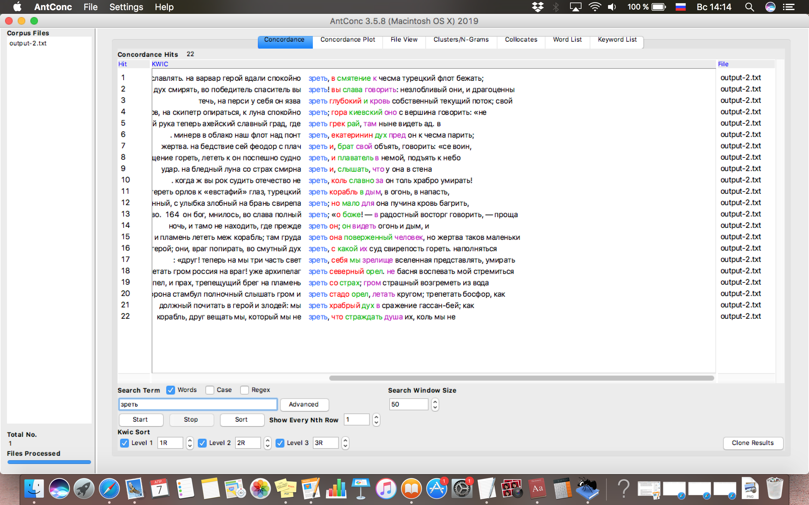
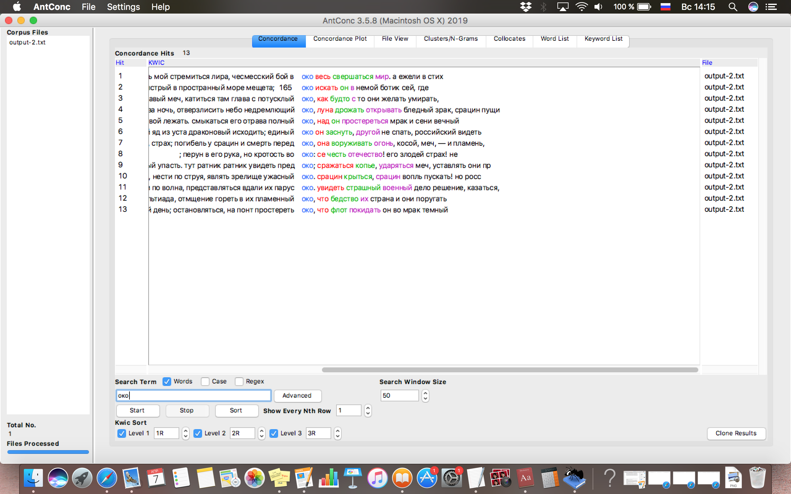
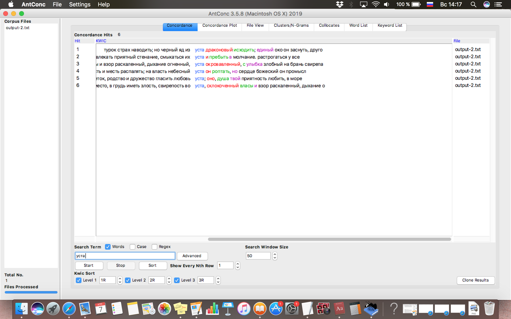
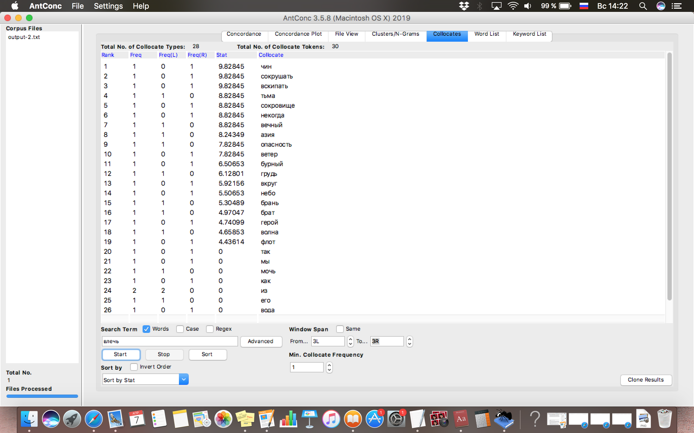
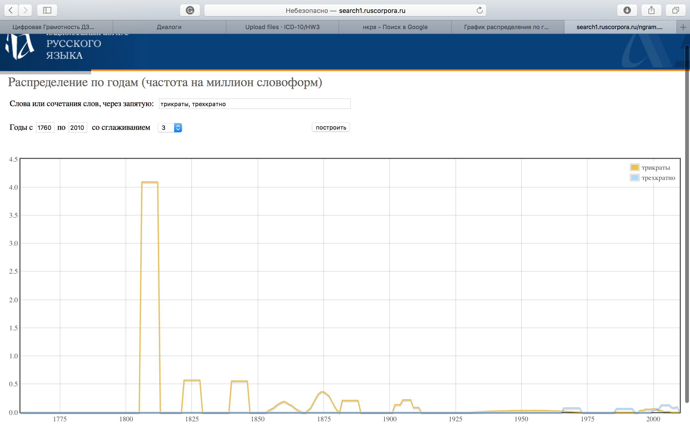
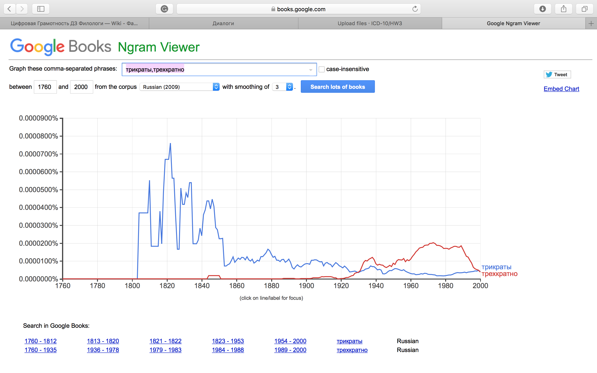
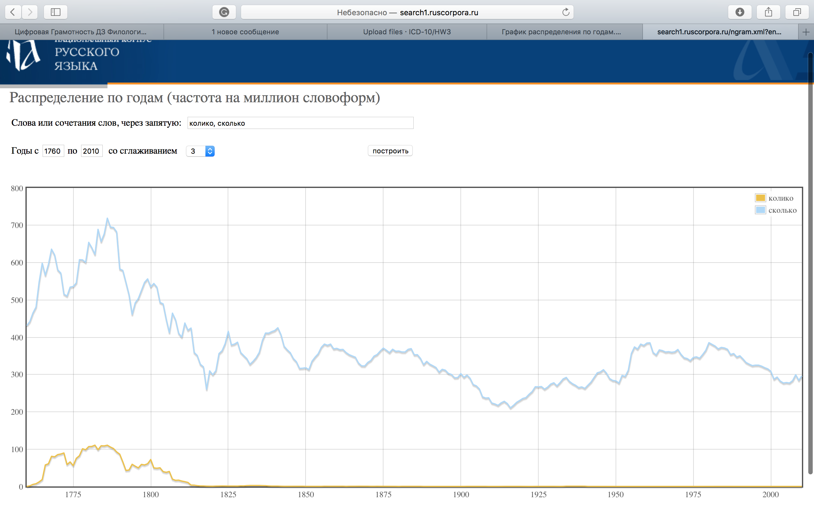
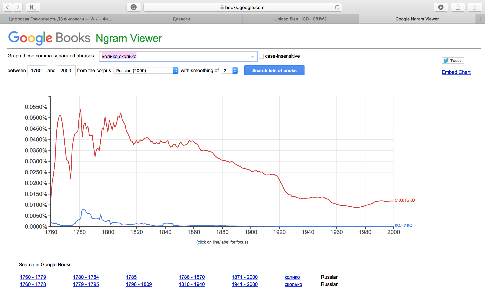

# HW3

4)

5)

6) 

2)

Основываясь на данных графиков Google Ngrams и НКРЯ, можно прийти к выводу, что употребление устаревших слов было намного более частотным в среднем до начала 20-го века, иногда даже превышая употребление аналогов, однако с началом 20 века современные аналоги окончательно заняли лидирующую позицию по частотности употребления. 

ipm:

колико 1,771148142125931

сколько 311,513910184710782

очи 12,034634089226195

глаза 4728,118875514250404

трикраты  0,059979120350878

трехкратно  0,031753651950465

3) Корпус действительно значительно упрощает работу с текстами, когда речь идет о своего рода статистических данных, которые больше необходимы для лингвистики и родственных областей гуманитарной науки. Кроме того, исследование корпуса может быть полезно при работе с тексами, принадлежащими к конкретному периоду или написанными определенным автором или группой, что, безусловно, играет большую роль для филолога.  
