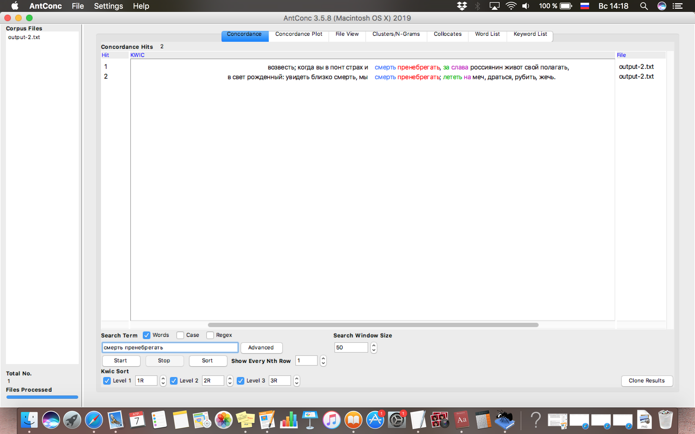
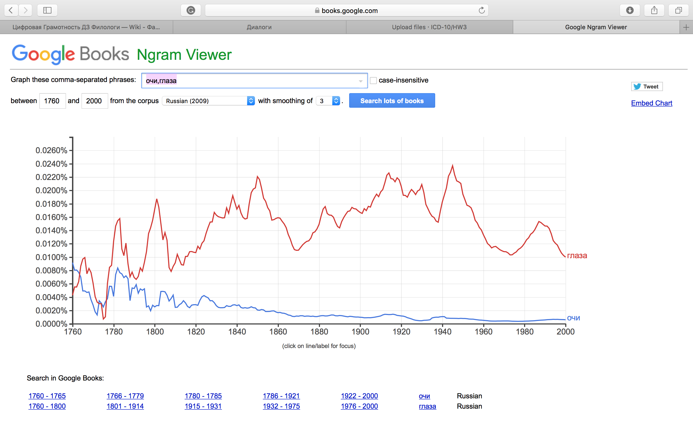

# HW3

4)

5)

6) 

2)

Основываясь на данных графиков Google Ngrams и НКРЯ, можно прийти к выводу, что употребление устаревших слов было намного более частотным в среднем до начала 20-го века, иногда даже превышая употребление аналогов, однако 
